# 🎓 Online Learning Platform for Special Needs Education (SWE Project)

---

## 📌 Overview
An **inclusive online learning platform** tailored for students with special needs, featuring adaptive learning, accessibility controls, progress tracking, and communication tools for learners, instructors, and caregivers.

- **Process model:** Incremental development  
- **Highlights:** accessibility settings (text size, contrast, screen reader), multi-format lessons (video/audio/text), verified messaging, quizzes, progress dashboards  

---

## 🎯 Objectives
- Deliver a **clear, usable** experience across diverse needs  
- Enable **customizable accessibility** (text size, contrast, screen reader compatibility)  
- Support **personalized learning** and **progress tracking**  
- Facilitate **communication** (student ↔ instructor; group discussions)  

---

## ✅ Requirements (Summary)

### Functional Requirements
- Account management (create, login, reset password, update profile)  
- Accessibility customization (text size, color contrast, screen reader support)  
- Browse, filter, and access courses in multiple formats (video/audio/text)  
- Track progress and display milestones  
- Take interactive quizzes with feedback  
- Communicate with instructors and participate in discussions  
- Report technical issues via support ticket system  

### Non-Functional Requirements
- **Accessibility:** sign language support, captions, transcripts  
- **Adaptability:** adaptive learning pathways with personalized recommendations  
- **Ease of use:** simple, intuitive, multilingual UI  
- **Security & Privacy:** encrypted data storage & transmission  
- **Reliability:** 99.9% uptime, error handling, recovery  
- **Interoperability:** API integration with LMS/assistive tools  
- **Scalability:** cross-platform support (desktop, mobile, tablet)  

---

## 🖼️ Diagrams

### 1) Context Diagram
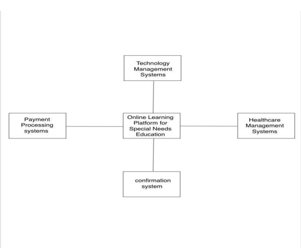

### 2) Use Case Diagram
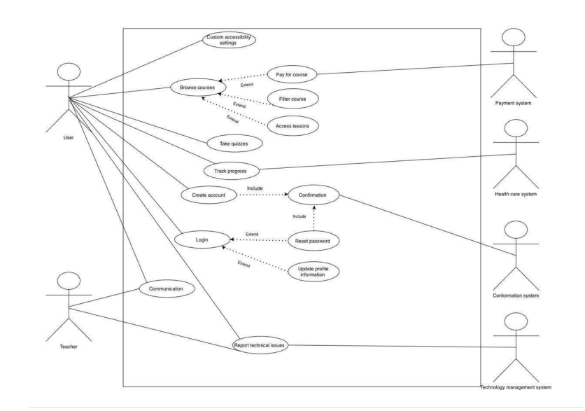

### 3) Sequence Diagrams (4)
| Sequence 1 | Sequence 2 | Sequence 3 | Sequence 4 |
|------------|------------|------------|------------|
| 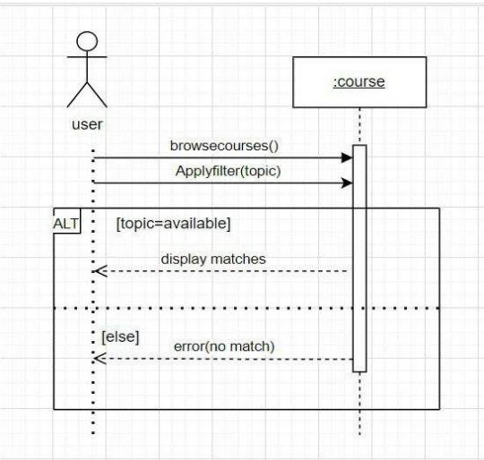 | 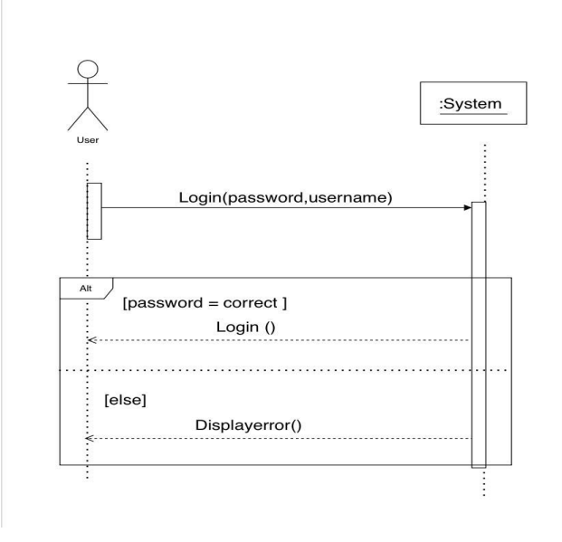 | 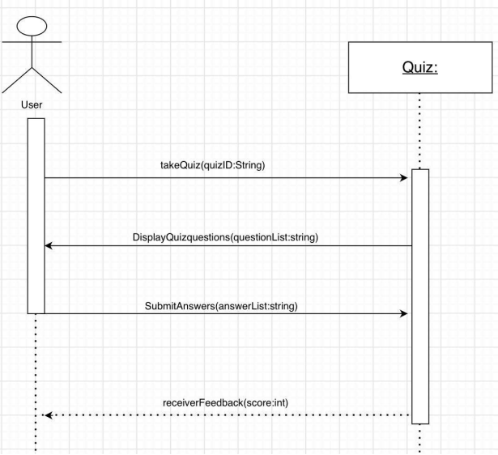 | 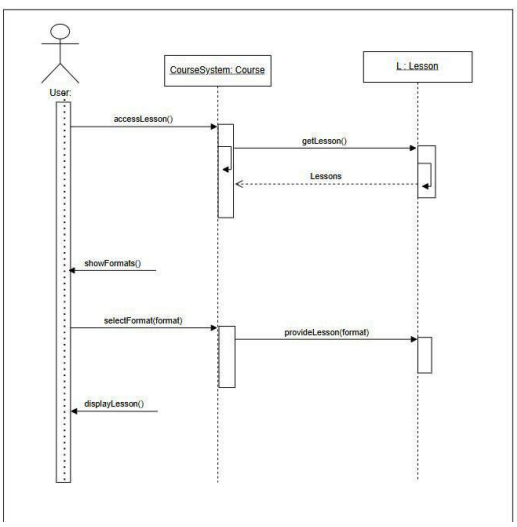 |

### 4) Activity Diagrams (4)
| Activity 1 | Activity 2 | Activity 3 | Activity 4 |
|------------|------------|------------|------------|
| 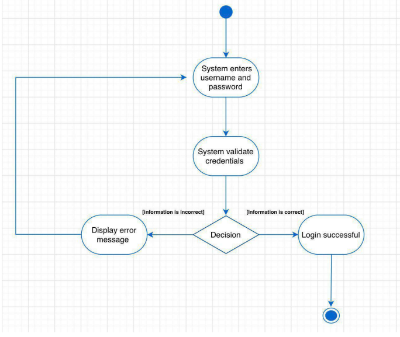 | 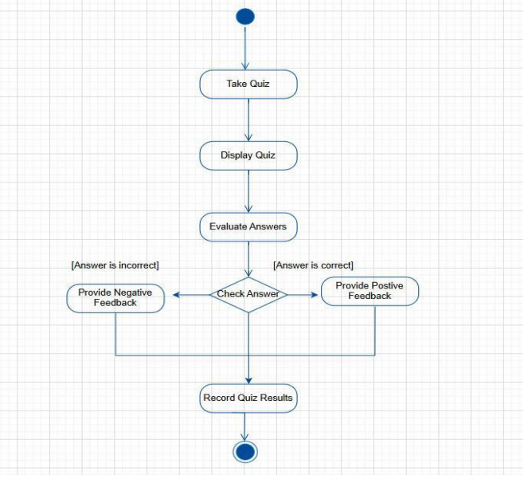 | 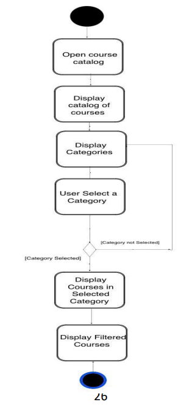 | 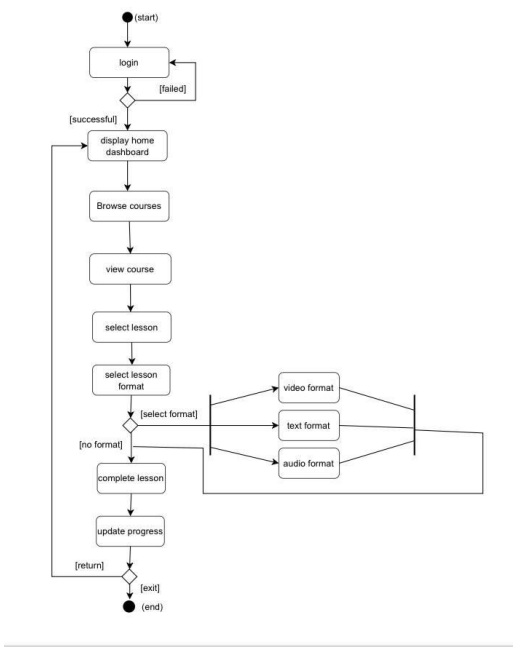 |

### 5) State Diagram
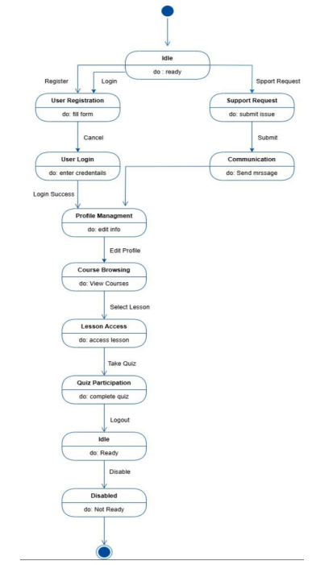

### 6) Architecture Diagram

The system follows a **Client–Server Architecture**, allowing multiple users to simultaneously access courses, lessons, quizzes, discussions, and technical support. This ensures scalability, high availability, and integration with external platforms.  

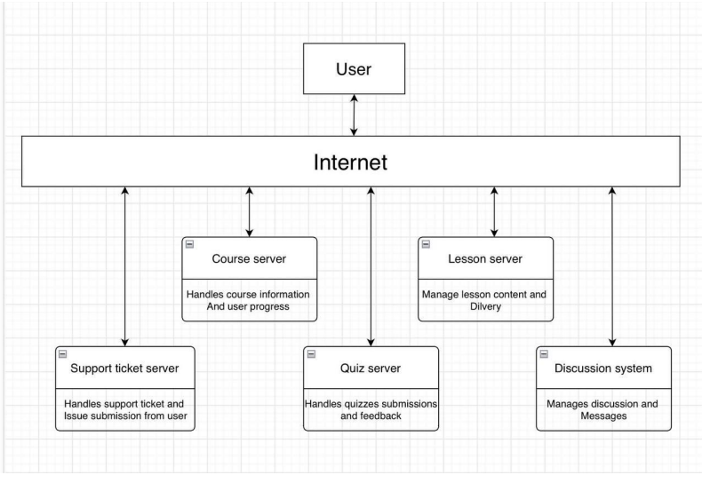

---

## 🧑‍💻 Key Use Case Scenarios (Examples)

- **Create Account** → Register → Verify email → Account created  
- **Login** → Validate credentials → Access granted  
- **Reset Password** → Request reset → Email link → New password set  
- **Update Profile** → Edit info → Verify → Database updated  
- **Accessibility Settings** → Adjust text size & contrast, screen reader support  
- **Browse/Filter Courses** → Course catalog + filters (difficulty, duration, etc.)  
- **Access Lessons** → Lessons available in multiple formats (video/audio/text)  
- **Take Quizzes** → Immediate feedback provided  
- **Communicate** → Student ↔ Instructor messaging  
- **Report Issues** → Submit support ticket → Tech team resolution  

---

## 📑 Full Report
For the complete details, check out the full report.

---

## 👥 Team
- **Anfal Saad Alkuraydis** 
- **Atheer Alshehri** 
- **Haya Abdullah Alhodaib** 
- **Allolo Khalid Albasri** 

---

  

